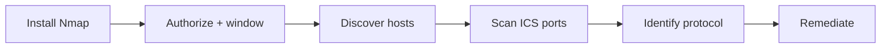

# Nmap OT Howto

**Set up Nmap. Scan ICS/OT safely. Turn open ports into hardening work.**

[](LICENSE)
[](https://nmap.org/)
[](SAFE-USE.md)
[](SAFE-USE.md)

<br>

| | |
|:--|:--|
| **Who this is for** | Defenders, OT engineers, and authorized assessors |
| **What you get** | Install steps, OT-safe defaults, copy-paste scan commands, reporting template |
| **What you won’t get** | Exploit payloads, credential attacks, or DoS recipes |

> **Stop if you don’t have written authorization.** Live OT can fault under aggressive scans. Read [SAFE-USE.md](SAFE-USE.md) before Step 3.

Companion tooling: **[ICS OT Protector](https://github.com/spinfosecurity/ics-ot-protector)** · Portfolio: **[spinfosecurity.github.io](https://spinfosecurity.github.io)**

---

## Contents

1. [Start here](#1-start-here)
2. [Install Nmap](#2-install-nmap)
3. [Pre-scan checklist](#3-pre-scan-checklist)
4. [Scan workflow](#4-scan-workflow)
5. [Protocol commands](#5-protocol-commands)
6. [Port cheat sheet](#6-port-cheat-sheet)
7. [Report findings](#7-report-findings)
8. [Scope](#8-scope)

---

## 1. Start here



| Step | You do | Time sense |
|------|--------|------------|
| **2** | Install and verify Nmap | Once per workstation |
| **3** | Complete the checklist | Every engagement |
| **4** | Run discovery → ports → NSE | Slow on purpose |
| **7** | Write exposure → action | Per finding |

Replace `<target>` everywhere with a host or CIDR from your **signed scope**.

---

## 2. Install Nmap

Pick your OS. When finished you should see a version string from `nmap --version`.

<details>
<summary><strong>Linux — Debian / Ubuntu</strong></summary>

```bash
sudo apt update
sudo apt install -y nmap
nmap --version
```

</details>

<details>
<summary><strong>Linux — RHEL / Fedora / CentOS</strong></summary>

```bash
sudo dnf install -y nmap    # older: sudo yum install -y nmap
nmap --version
```

</details>

<details>
<summary><strong>macOS</strong></summary>

```bash
brew install nmap
nmap --version
```

</details>

<details>
<summary><strong>Windows</strong></summary>

1. Download the installer → [nmap.org/download](https://nmap.org/download.html)
2. Install (enable **Npcap** when prompted)
3. Open **Nmap Command Prompt** or Zenmap
4. Run `nmap --version`

</details>

### Verify discovery scripts

```bash
nmap --script-help 'modbus-discover,enip-info,bacnet-info,s7-info,omron-info,fox-info,iec-identify'
```

| Result | Action |
|--------|--------|
| Script listed | You’re good |
| Script missing | Upgrade Nmap, then re-check |

---

## 3. Pre-scan checklist

Complete every box before touching production OT.

- [ ] Written authorization (targets, excludes, max rate, contacts)
- [ ] Change window scheduled; OT / process owner reachable
- [ ] Abort plan agreed (stop scan · restore path · escalate)
- [ ] Passive sources checked first (inventory, firewall logs, SPAN) where available
- [ ] Same timing options understood by the team

### OT-safe defaults

| Do this | Don’t do this on live OT |
|---------|---------------------------|
| `-sT -Pn -T1` or `-T2` | `-T4` / `-T5` |
| `--scan-delay 200ms` | `-A` (OS + scripts + traceroute bundle) |
| `--max-rate 20`–`30` | Full `-p-` or large UDP blasts |
| Narrow ICS port lists | Unreviewed `vuln` NSE on controllers |

> **Abort immediately** if controllers fault, I/O drops, or operators report process impact.

---

## 4. Scan workflow

Three passes. Stay slow. One purpose per command.

### A — Find hosts

```bash
nmap -sn -T2 --max-retries 1 <target>
```

ICMP is often filtered on OT. Empty result → skip ahead and use `-Pn` on the port scan (treat hosts as online).

### B — Probe common ICS ports

```bash
nmap -sT -Pn -T1 --scan-delay 200ms --max-rate 30 \
  -p 102,502,2404,20000,44818,47808,1911,4911,2222,2455,9600 \
  -oA ot-ports \
  <target>
```

| Flag | Meaning |
|------|---------|
| `-sT` | TCP connect (predictable, firewall-friendly) |
| `-Pn` | Skip host ping; scan listed targets |
| `-T1` | Slow timing template |
| `-oA ot-ports` | Saves `.nmap` / `.gnmap` / `.xml` (keep offline) |

### C — Identify the open protocol

Only run NSE against hosts that showed the matching port in step B.  
Use the [protocol command table](#5-protocol-commands) below — **one protocol at a time**.

> **Tip:** If an NSE description mentions privilege gain, brute force, or DoS, skip it on production controllers. Identity / discovery only.

---

## 5. Protocol commands

Shared slow prefix (copy once, swap port + script):

```bash
nmap -sT -Pn -T1 --scan-delay 200ms -p <PORT> --script <SCRIPT> <target>
```

| If you saw port | Protocol | Command |
|-----------------|----------|---------|
| **502** | Modbus/TCP | `nmap -sT -Pn -T1 --scan-delay 200ms -p 502 --script modbus-discover <target>` |
| **44818** | EtherNet/IP | `nmap -sT -Pn -T1 --scan-delay 200ms -p 44818 --script enip-info <target>` |
| **102** | Siemens S7 | `nmap -sT -Pn -T1 --scan-delay 200ms -p 102 --script s7-info <target>` |
| **9600** | OMRON FINS | `nmap -sT -Pn -T1 --scan-delay 200ms -p 9600 --script omron-info <target>` |
| **1911 / 4911** | Niagara Fox | `nmap -sT -Pn -T1 --scan-delay 200ms -p 1911,4911 --script fox-info <target>` |
| **2404** | IEC-104 | `nmap -sT -Pn -T1 --scan-delay 200ms -p 2404 --script iec-identify <target>` |
| **47808** | BACnet/IP | `nmap -sU -Pn -T1 --scan-delay 200ms -p 47808 --script bacnet-info <target>` |
| **20000** | DNP3 | `nmap -sT -Pn -T1 --scan-delay 200ms -p 20000 <target>` |

| Flag | Note |
|------|------|
| `modbus-discover` / `iec-identify` | Marked **intrusive** by Nmap — extra caution |
| BACnet | Usually **UDP** (`-sU`), not TCP |
| DNP3 | Many Nmap builds have no identity NSE — open `20000` = exposure to investigate |

---

## 6. Port cheat sheet

| Port | Typical service | Transport |
|------|-----------------|-----------|
| 102 | Siemens S7comm | TCP |
| 502 | Modbus/TCP | TCP |
| 2404 | IEC 60870-5-104 | TCP |
| 20000 | DNP3 | TCP |
| 44818 | EtherNet/IP / CIP | TCP |
| 47808 | BACnet/IP | UDP (often) |
| 1911, 4911 | Niagara Fox | TCP |
| 2222 | EtherNet/IP (alt) | TCP |
| 2455 | WAGO / related | TCP |
| 9600 | OMRON FINS | TCP |

**Open port ≠ vulnerability.** It means reachability. Ask: should this conduit exist between these zones (Purdue / IEC 62443)?

---

## 7. Report findings

Capture four fields per service:

| Field | Ask |
|-------|-----|
| **Asset** | IP, role, zone |
| **Exposure** | Who can reach it — engineering VLAN, enterprise, internet? |
| **Expected?** | Allowlisted conduit or accidental flat path? |
| **Action** | Allowlist · jump host · disable service · patch path · monitor |

### Copy-paste report block

```text
Engagement: <name>     Window: <dates>     Auth: <ticket>
Scope: <CIDRs>
Method: Nmap -sT -T1 · ports <list> · scripts <list>

Findings:
  - <ip:port>  protocol=<...>  zone=<...>  expected=<y/n>
    action: <segmentation | allowlist | patch | monitor>

Incidents during scan: <none | describe>
```

Prefer CISA ICS advisories and network controls over chasing exploit PoCs on live process networks.

---

## 8. Scope

| In this guide | Not in this guide |
|---------------|-------------------|
| Install + verify Nmap | Exploit development |
| OT-safe timing / rate limits | DoS against controllers |
| Identity-oriented NSE | Credential attacks |
| Exposure → remediation notes | Scanning without permission |

---

## Related

| Resource | Link |
|----------|------|
| Sector scanners | [ICS OT Protector](https://github.com/spinfosecurity/ics-ot-protector) |
| Portfolio | [spinfosecurity.github.io](https://spinfosecurity.github.io) |
| Nmap download | [nmap.org/download](https://nmap.org/download.html) |
| NSE reference | [nmap.org/nsedoc](https://nmap.org/nsedoc/) |
| Safety checklist | [SAFE-USE.md](SAFE-USE.md) |

---

MIT License — [LICENSE](LICENSE)
