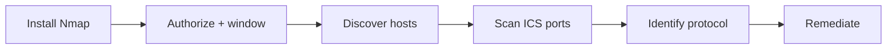

# Nmap OT Howto

**Set up Nmap. Scan ICS/OT safely. Turn open ports into hardening work.**

[](LICENSE)
[](https://nmap.org/)
[](SAFE-USE.md)
[](SAFE-USE.md)

<br>

| | |
|:--|:--|
| **Who this is for** | Defenders, OT engineers, and authorized assessors |
| **What you get** | Install, OT-safe defaults, copy-paste scans, output reading, troubleshooting, reporting |
| **What you won’t get** | Exploit payloads, credential attacks, or DoS recipes |

> **Stop if you don’t have written authorization.** Live OT can fault under aggressive scans. Read [SAFE-USE.md](SAFE-USE.md) before Step 3.

Companion tooling: **[ICS OT Protector](https://github.com/spinfosecurity/ics-ot-protector)** · Portfolio: **[spinfosecurity.github.io](https://spinfosecurity.github.io)**

---

## Contents

1. [Start here](#1-start-here)
2. [First engagement walkthrough](#2-first-engagement-walkthrough)
3. [Install Nmap](#3-install-nmap)
4. [Pre-scan checklist](#4-pre-scan-checklist)
5. [Scan workflow](#5-scan-workflow)
6. [Protocol commands](#6-protocol-commands)
7. [Port cheat sheet](#7-port-cheat-sheet)
8. [Report findings](#8-report-findings)
9. [Read your output](#9-read-your-output)
10. [Troubleshooting](#10-troubleshooting)
11. [Nmap vs ICS OT Protector](#11-nmap-vs-ics-ot-protector)
12. [Quick card](#12-quick-card)
13. [Scope](#13-scope)

---

## 1. Start here



| Step | You do | Time sense |
|------|--------|------------|
| **3** | Install and verify Nmap | Once per workstation |
| **4** | Complete the checklist | Every engagement |
| **5** | Run discovery → ports → NSE | Slow on purpose |
| **8** | Write exposure → action | Per finding |

Replace `<target>` everywhere with a host or CIDR from your **signed scope**.

---

## 2. First engagement walkthrough

**Example only** — these IPs are fake. Do not scan them on the public internet. Use your authorized scope instead.

| Field | Example value |
|-------|----------------|
| Engagement | `OT-ENG-2026-081` |
| Authorized CIDR | `10.255.10.0/24` (engineering OT VLAN) |
| Exclude | `10.255.10.1` (firewall) |
| Max rate | `30` packets/sec · `-T1` · `--scan-delay 200ms` |
| OT owner | On call for the window |

Assumed inventory (what the plant thinks is there):

| IP | Role |
|----|------|
| `10.255.10.10` | Engineering workstation |
| `10.255.10.20` | Modbus PLC |
| `10.255.10.30` | EtherNet/IP drive |

### Minute 0 — Confirm setup

```bash
nmap --version
nmap --script-help modbus-discover enip-info
```

### Minute 5 — Host discovery

```bash
nmap -sn -T2 --max-retries 1 --exclude 10.255.10.1 10.255.10.0/24
```

Example result (illustrative):

```text
Nmap scan report for 10.255.10.10
Nmap scan report for 10.255.10.20
Nmap scan report for 10.255.10.30
```

If this returns nothing, skip ping and use `-Pn` below.

### Minute 15 — ICS port pass

```bash
nmap -sT -Pn -T1 --scan-delay 200ms --max-rate 30 \
  --exclude 10.255.10.1 \
  -p 102,502,2404,20000,44818,47808,1911,4911,2222,2455,9600 \
  -oA ot-ports \
  10.255.10.0/24
```

Example reading of `ot-ports.nmap`:

```text
Nmap scan report for 10.255.10.20
PORT      STATE  SERVICE
502/tcp   open   modbus
44818/tcp closed EtherNetIP-2

Nmap scan report for 10.255.10.30
PORT      STATE SERVICE
502/tcp   closed modbus
44818/tcp open   EtherNetIP-2
```

### Minute 25 — Identify (one protocol each)

```bash
# Only because 502 was open on .20
nmap -sT -Pn -T1 --scan-delay 200ms -p 502 \
  --script modbus-discover 10.255.10.20

# Only because 44818 was open on .30
nmap -sT -Pn -T1 --scan-delay 200ms -p 44818 \
  --script enip-info 10.255.10.30
```

### Minute 35 — Write two findings

```text
Engagement: OT-ENG-2026-081     Window: 2026-08-23 14:00-16:00Z     Auth: CHG-4412
Scope: 10.255.10.0/24  exclude 10.255.10.1
Method: Nmap -sT -T1 · ICS ports · modbus-discover · enip-info

Findings:
  - 10.255.10.20:502  protocol=Modbus/TCP  zone=L2  expected=y
    action: keep allowlisted from eng VLAN only; monitor for new sources
  - 10.255.10.30:44818  protocol=EtherNet/IP  zone=L2  expected=y
    action: confirm no path from enterprise; document owner

Incidents during scan: none
```

That’s a complete first pass: authorize → discover → ports → identity → report.

---

## 3. Install Nmap

Pick your OS. When finished you should see a version string from `nmap --version`.

<details>
<summary><strong>Linux — Debian / Ubuntu</strong></summary>

```bash
sudo apt update
sudo apt install -y nmap
nmap --version
```

</details>

<details>
<summary><strong>Linux — RHEL / Fedora / CentOS</strong></summary>

```bash
sudo dnf install -y nmap    # older: sudo yum install -y nmap
nmap --version
```

</details>

<details>
<summary><strong>macOS</strong></summary>

```bash
brew install nmap
nmap --version
```

</details>

<details>
<summary><strong>Windows</strong></summary>

1. Download the installer → [nmap.org/download](https://nmap.org/download.html)
2. Install (enable **Npcap** when prompted)
3. Open **Nmap Command Prompt** or Zenmap
4. Run `nmap --version`

</details>

### Verify discovery scripts

```bash
nmap --script-help 'modbus-discover,enip-info,bacnet-info,s7-info,omron-info,fox-info,iec-identify'
```

| Result | Action |
|--------|--------|
| Script listed | You’re good |
| Script missing | Upgrade Nmap, then re-check |

---

## 4. Pre-scan checklist

Complete every box before touching production OT.

- [ ] Written authorization (targets, excludes, max rate, contacts)
- [ ] Change window scheduled; OT / process owner reachable
- [ ] Abort plan agreed (stop scan · restore path · escalate)
- [ ] Passive sources checked first (inventory, firewall logs, SPAN) where available
- [ ] Same timing options understood by the team

### OT-safe defaults

| Do this | Don’t do this on live OT |
|---------|---------------------------|
| `-sT -Pn -T1` or `-T2` | `-T4` / `-T5` |
| `--scan-delay 200ms` | `-A` (OS + scripts + traceroute bundle) |
| `--max-rate 20`–`30` | Full `-p-` or large UDP blasts |
| Narrow ICS port lists | Unreviewed `vuln` NSE on controllers |

> **Abort immediately** if controllers fault, I/O drops, or operators report process impact.

---

## 5. Scan workflow

Three passes. Stay slow. One purpose per command.

### A — Find hosts

```bash
nmap -sn -T2 --max-retries 1 <target>
```

ICMP is often filtered on OT. Empty result → skip ahead and use `-Pn` on the port scan (treat hosts as online).

### B — Probe common ICS ports

```bash
nmap -sT -Pn -T1 --scan-delay 200ms --max-rate 30 \
  -p 102,502,2404,20000,44818,47808,1911,4911,2222,2455,9600 \
  -oA ot-ports \
  <target>
```

| Flag | Meaning |
|------|---------|
| `-sT` | TCP connect (predictable, firewall-friendly) |
| `-Pn` | Skip host ping; scan listed targets |
| `-T1` | Slow timing template |
| `-oA ot-ports` | Saves `.nmap` / `.gnmap` / `.xml` (keep offline) |

### C — Identify the open protocol

Only run NSE against hosts that showed the matching port in step B.  
Use the [protocol command table](#6-protocol-commands) below — **one protocol at a time**.

> **Tip:** If an NSE description mentions privilege gain, brute force, or DoS, skip it on production controllers. Identity / discovery only.

---

## 6. Protocol commands

Shared slow prefix (copy once, swap port + script):

```bash
nmap -sT -Pn -T1 --scan-delay 200ms -p <PORT> --script <SCRIPT> <target>
```

| If you saw port | Protocol | Command |
|-----------------|----------|---------|
| **502** | Modbus/TCP | `nmap -sT -Pn -T1 --scan-delay 200ms -p 502 --script modbus-discover <target>` |
| **44818** | EtherNet/IP | `nmap -sT -Pn -T1 --scan-delay 200ms -p 44818 --script enip-info <target>` |
| **102** | Siemens S7 | `nmap -sT -Pn -T1 --scan-delay 200ms -p 102 --script s7-info <target>` |
| **9600** | OMRON FINS | `nmap -sT -Pn -T1 --scan-delay 200ms -p 9600 --script omron-info <target>` |
| **1911 / 4911** | Niagara Fox | `nmap -sT -Pn -T1 --scan-delay 200ms -p 1911,4911 --script fox-info <target>` |
| **2404** | IEC-104 | `nmap -sT -Pn -T1 --scan-delay 200ms -p 2404 --script iec-identify <target>` |
| **47808** | BACnet/IP | `nmap -sU -Pn -T1 --scan-delay 200ms -p 47808 --script bacnet-info <target>` |
| **20000** | DNP3 | `nmap -sT -Pn -T1 --scan-delay 200ms -p 20000 <target>` |

| Flag | Note |
|------|------|
| `modbus-discover` / `iec-identify` | Marked **intrusive** by Nmap — extra caution |
| BACnet | Usually **UDP** (`-sU`), not TCP |
| DNP3 | Many Nmap builds have no identity NSE — open `20000` = exposure to investigate |

---

## 7. Port cheat sheet

| Port | Typical service | Transport |
|------|-----------------|-----------|
| 102 | Siemens S7comm | TCP |
| 502 | Modbus/TCP | TCP |
| 2404 | IEC 60870-5-104 | TCP |
| 20000 | DNP3 | TCP |
| 44818 | EtherNet/IP / CIP | TCP |
| 47808 | BACnet/IP | UDP (often) |
| 1911, 4911 | Niagara Fox | TCP |
| 2222 | EtherNet/IP (alt) | TCP |
| 2455 | WAGO / related | TCP |
| 9600 | OMRON FINS | TCP |

**Open port ≠ vulnerability.** It means reachability. Ask: should this conduit exist between these zones (Purdue / IEC 62443)?

---

## 8. Report findings

Capture four fields per service:

| Field | Ask |
|-------|-----|
| **Asset** | IP, role, zone |
| **Exposure** | Who can reach it — engineering VLAN, enterprise, internet? |
| **Expected?** | Allowlisted conduit or accidental flat path? |
| **Action** | Allowlist · jump host · disable service · patch path · monitor |

### Copy-paste report block

```text
Engagement: <name>     Window: <dates>     Auth: <ticket>
Scope: <CIDRs>
Method: Nmap -sT -T1 · ports <list> · scripts <list>

Findings:
  - <ip:port>  protocol=<...>  zone=<...>  expected=<y/n>
    action: <segmentation | allowlist | patch | monitor>

Incidents during scan: <none | describe>
```

Prefer CISA ICS advisories and network controls over chasing exploit PoCs on live process networks.

---

## 9. Read your output

`-oA ot-ports` writes three files. Use them like this:

| File | Best for |
|------|----------|
| `ot-ports.nmap` | Human review (what you read first) |
| `ot-ports.gnmap` | Grep / spreadsheet import (`Host:`, `Ports:`) |
| `ot-ports.xml` | Archival / tooling — keep offline, don’t publish |

### What “useful” looks like (sanitized)

```text
Nmap scan report for 10.20.30.40
Host is up (0.012s latency).

PORT      STATE SERVICE
102/tcp   open  iso-tsap
502/tcp   open  modbus
44818/tcp open  EtherNetIP-2
20000/tcp closed dnp
```

| You see | Meaning | Next move |
|---------|---------|-----------|
| `open` on an ICS port | Reachable from your scan source | Run the matching identity NSE (Step 5); ask if that conduit should exist |
| `closed` | Host answered; service not listening | Usually fine — note if inventory expected it open |
| `filtered` | No useful reply (ACL / firewall / silent drop) | Don’t crank timing — document as blocked or unknown |
| NSE vendor / model lines | Device identity hint | Record under **Asset**; map to zone + owner |

```bash
# Pull open ports out of greppable output
grep 'Ports:' ot-ports.gnmap | grep -i open
```

---

## 10. Troubleshooting

| Symptom | Likely cause | What to try |
|---------|--------------|-------------|
| Host discovery finds nothing | ICMP filtered | Skip `-sn`; use `-Pn` on the port scan |
| Everything `filtered` | Firewall / wrong VLAN / no route | Confirm you’re on the authorized OT path; don’t raise `-T` |
| `Permission denied` / raw socket errors | Needs privileges for some scan types | Prefer `-sT` (no root on many Linux setups); on Windows reinstall Npcap |
| NSE script “did not match” | Old Nmap build | Upgrade Nmap; re-run `--script-help` |
| Scan takes forever | Large CIDR + `-T1` | Shrink scope; raise delay only after OT owner agrees — never jump to `-T4` on live OT |
| UDP BACnet always empty | UDP is lossy / filtered | Keep `--scan-delay`; accept more `open\|filtered` ambiguity than TCP |
| Process alarms during scan | Too aggressive or fragile device | **Abort**; document; resume only with slower rate after owner approval |

---

## 11. Nmap vs ICS OT Protector

| Need | Use |
|------|-----|
| Learn / teach OT-safe Nmap flags and NSE identity | **This howto** |
| One-off authorized discovery with full control of Nmap options | **Nmap** (commands above) |
| Sector port catalogs + CISA-oriented remediation notes (water, energy, BAS, rail) | **[ICS OT Protector](https://github.com/spinfosecurity/ics-ot-protector)** |
| TCP reachability checks without hand-writing Nmap each time | **ICS OT Protector** scan mode |

They complement each other: Protector for repeatable sector coverage; this guide for understanding and tuning Nmap itself.

---

## 12. Quick card

Print or pin this for the engagement window.

```text
AUTH      written scope + OT owner on call
TIMING    -sT -Pn -T1 --scan-delay 200ms --max-rate 30
PORTS     102,502,2404,20000,44818,47808,1911,4911,2222,2455,9600
SAVE      -oA ot-ports
NSE       one protocol at a time · identity only
ABORT     faults / lost I/O / operator impact → stop
OUTPUT    open = exposure to explain · not a free exploit
```

---

## 13. Scope

| In this guide | Not in this guide |
|---------------|-------------------|
| Install + verify Nmap | Exploit development |
| OT-safe timing / rate limits | DoS against controllers |
| Identity-oriented NSE | Credential attacks |
| Output reading + troubleshooting | Scanning without permission |
| Exposure → remediation notes | Publishing live target lists |

---

## Related

| Resource | Link |
|----------|------|
| Sector scanners | [ICS OT Protector](https://github.com/spinfosecurity/ics-ot-protector) |
| Portfolio | [spinfosecurity.github.io](https://spinfosecurity.github.io) |
| Nmap download | [nmap.org/download](https://nmap.org/download.html) |
| NSE reference | [nmap.org/nsedoc](https://nmap.org/nsedoc/) |
| Safety checklist | [SAFE-USE.md](SAFE-USE.md) |

---

MIT License — [LICENSE](LICENSE)
